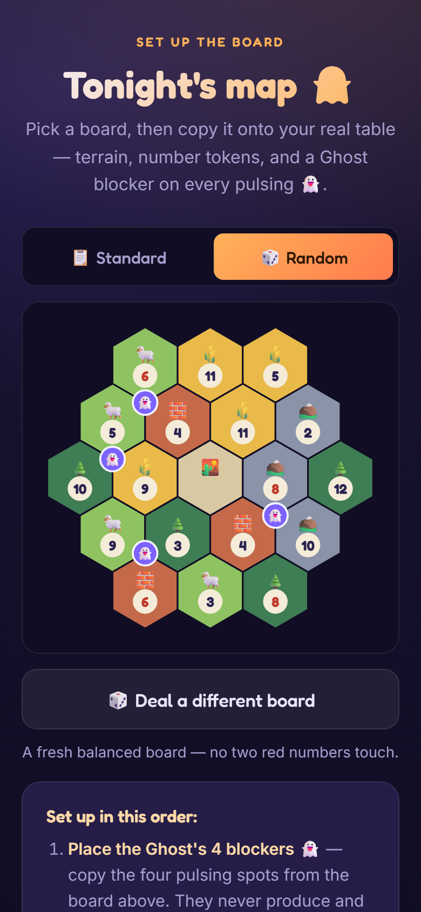
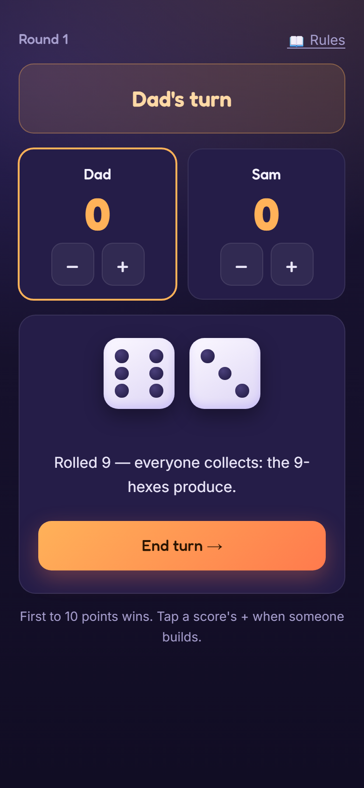
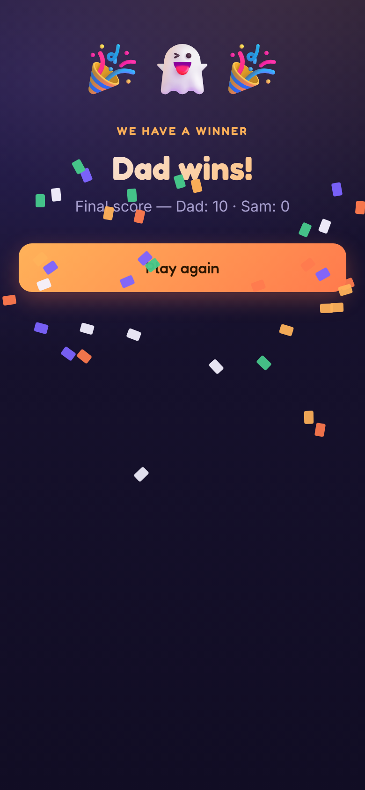

<div align="center">

# 👻 Third Settler

### *The player who always shows up.*

[](https://third-settler.vercel.app/)
[](https://github.com/mphinance/third-settler/actions/workflows/screenshots.yml)
[](https://third-settler.vercel.app/)


**A free web app that plays the third player — so two people can finally enjoy the board games that need three or four.**

### → [**Open Third Settler**](https://third-settler.vercel.app/) ←

</div>

---

<div align="center">






<sub>The landing page · tonight's board with the Ghost's blockers · game night · a winner 🎉</sub>

<sub>↻ These refresh themselves whenever the UI changes — see [`.github/workflows/screenshots.yml`](.github/workflows/screenshots.yml)</sub>

</div>

---

## 🎲 The problem

Some of the best board games quietly demand three or four players. If it's just you and
your kid on a Tuesday night, that shelf may as well be locked. Single parents hit this wall
constantly: the game is *right there*, and you still can't play it.

## ✨ The fix

Third Settler runs the missing player for you — the **Ghost**. You play on the real board
you already own, with the real pieces. The app generates the map, rolls the dice, takes the
Ghost's turns, and keeps score. Two humans, one friendly phantom, a real game night.

No login. No cost. Installs on any phone. Built to keep your eyes on your kid and the
table — not a screen.

## 📂 What's in here right now

```
third-settler/
├── site/
│   ├── index.html          ← the landing page — a complete, installable PWA
│   ├── play.html           ← the game companion — setup, dice, Ghost, scores
│   ├── rules.html          ← printable two-player rules sheet
│   ├── manifest.webmanifest ← PWA manifest
│   ├── sw.js               ← service worker (network-first, offline support)
│   └── icon.svg            ← app icon
├── launch/                 ← launch drafts (Substack post, Product Hunt, sharing copy)
├── PLAN.md                 ← the full master plan: architecture, MVP, roadmap
├── README.md               ← you are here
└── LICENSE                 ← MIT
```

The landing page isn't a mockup — it's a real, self-contained Progressive Web App. One HTML
file, zero dependencies, zero build step, nothing to break. It even has a **working dice
roller** so you can feel a piece of the product before it's finished.

## 👀 Try it

**Live:** **[third-settler.vercel.app](https://third-settler.vercel.app/)** — the real
thing, installable as an app straight from your browser.

**Play a game:** **[third-settler.vercel.app/play.html](https://third-settler.vercel.app/play.html)**
— the companion runs the whole game night: setup, dice, the Ghost's turns, and the score.

**Local quick look:** double-click `site/index.html` — opens right in your browser, dice
roller and all. (The offline + install features only wake up on the live https URL above.)

## 🧠 How it works — the "Game Master" model

A companion app can't *see* your physical table. So instead of fighting that, Third Settler
leans into it with four moves:

- 🗺️ **We draw the map** — the app generates a balanced board and tells you how to lay your
  tiles, so it knows the layout without ever needing to see it.
- 🎲 **We roll the dice** — every turn starts with a tap, so the app stays in rhythm with
  your game. No stopping to type in what happened.
- 👻 **We play the Ghost** — on the Ghost's turn, the app narrates exactly what it does in
  plain English. You just move the piece.
- ❤️ **You just play** — no accounts, barely any tapping. Eyes on your kid and the board.

Full architecture and reasoning live in **[PLAN.md](./PLAN.md)**.

## 👻 Meet the Ghost

The Ghost isn't a criminal mastermind — and that's the point. It's a **friendly pain in the
neck who always shows up**: a third player that blocks the good spots, takes its turns, and
never argues about whose go it is. Predictable, fair, and *just* annoying enough to make the
game a real game again.

**How does it know where to go?** It doesn't watch your table — it *deals* it. At setup the
app generates the board, scores every corner by production value, and marks the four
strongest with a pulsing 👻 for the Ghost's blockers. You copy those spots onto your real
board. Your own pieces are yours to place however you like — the Ghost is a blocker and
never needs to know where you built.

## 📲 Install it like a real app

Third Settler is a full PWA — installable, and it works offline once loaded. On a phone,
open it and tap **Install the app** (or your browser's **Add to Home Screen**); it lands on
your home screen like any other app — no app store, no account. The service worker is
network-first, so you always get the latest version while online.

## 🗺️ Roadmap

**Shipping first — v0.1 "Game Night":**

- [x] Project set up + master plan written
- [x] Landing page built as an installable PWA
- [x] Deployed live on Vercel
- [x] Playable game companion — setup, dice, the Ghost's turns, scores, win detection
- [x] Ghost turn engine — narrated road-building that targets the leader
- [x] In-app rules reference
- [x] Balanced board generator — deals a fresh map, no two red numbers adjacent
- [x] Printable one-page rules sheet

**Later:**

- [ ] More games converted for two players
- [ ] Optional saved games / accounts
- [ ] Camera-based board recognition
- [ ] ⚠️ A full digital game — **legally gated:** only after a license from the rights
  holder *or* a redesign into fully original IP. See [PLAN.md](./PLAN.md) § 10.

## 💜 The story

Built by a dad and his almost-eight-year-old son, who got tired of not being able to play
their favorite hex-and-resource game with just the two of them. If Third Settler gives one
other single parent a better game night — with no one missing from the table — it did its
job.

## 🛠️ Tech

- **Landing page:** a single self-contained HTML file. Zero dependencies, zero build.
- **The app (coming):** Next.js · TypeScript · Tailwind.
- **Hosting:** Vercel · **Source:** GitHub · **License:** MIT.

## 🚀 Deployment

Live at **[third-settler.vercel.app](https://third-settler.vercel.app/)** on Vercel —
every push to `main` redeploys automatically.

To deploy a fork: import the repo at [vercel.com/new](https://vercel.com/new), set **Root
Directory** to `site` and framework preset to **Other** (no build step needed).

## 🤝 Contributing

This is for single parents everywhere. Contributions are welcome — especially new game
conversions and translations. Open an issue or a pull request.

## 📜 License

MIT — see [LICENSE](./LICENSE). Free to use, fork, and share. That's the whole point.

> **Note:** Third Settler is an independent companion app for board games you already own.
> It is not affiliated with, endorsed by, or connected to any board game publisher, and uses
> no third-party names, logos, or artwork.

---

<div align="center">

**[📖 Read the full master plan →](./PLAN.md)**

*👻 The player who always shows up.*

</div>
